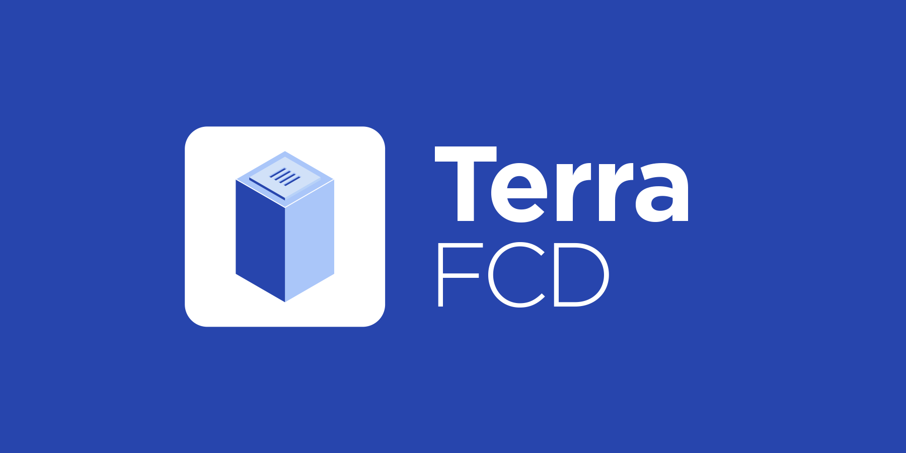

# Terra FCD



## Modules

- ### Collector(Indexer)
  - Takes block and tx from LCD and stores into the database in a usable form
  - Stores issuance, network and staking information to database every minute
  - Collect & cache validator info and store in db
  - Calculate validator daily return
  - Collect & cache proposal info
- ### Rest API server
  - Serves data via RESTFul API

## Prerequisites

1. `Node.js` >= 12
1. `PostgreSQL` == 10.x || 11.x

### Terra Core

1. You **must** use [columbus-4-tracking](https://github.com/terra-project/core/tree/columbus-4-tracking) for calculating taxes. This branch adds TaxCaps, TaxRate event in BeginBlocker
1. `terrad start --tracking` parameter creates the Richlist in the /tmp at the beginning of each day. The more accounts you have, the longer it takes, so you don't have to use them if you don't need it.
1. Setup a LCD
1. Configure firewall ([Reference](https://docs.terra.money/node/installation.html#firewall-configuration))

## Project setup

### 1. Clone

```bash
$ git clone https://github.com/terra-project/fcd.git
```

### 2. Install packages

```bash
npm i
```

### 3. Setup the database

FCD requires PostgreSQL as a backend database and [TypeORM](https://github.com/typeorm/typeorm) as an ORM.

#### Create a new database for FCD

```psql
postgres=> CREATE DATABASED fcd OWNER terra;
```

#### Synchronize Database Scheme

Table schema has to be synced before running Collector by setting `synchronize` to `true`. There is many way to configure TypeORM. Example is below:

**ormconfig.js**

```javascript
module.exports = {
  name: 'default',
  type: 'postgres',
  host: 'localhost',
  database: 'fcd',
  username: 'terra',
  password: '<password>',
  synchronize: true
}
```

> You shall not use CLI method, and it is good to disable synchronize option after the first sync.

### 4. Configure Environment Variables

| Name                   | Description                                            | Default                                                                                | Module(s)                          |
| ---------------------- | ------------------------------------------------------ | -------------------------------------------------------------------------------------- | ---------------------------------- |
| SERVER_PORT            | Listening port for API server                          | 3060                                                                                   | API                                |
| SENTRY_DSN             | Sentry DSN for error management                        |                                                                                        | All                                |
| CHAIN_ID               | Chain ID of Terra network                              | tequila-0004                                                                           | API, Collector                     |
| LCD_URI                | LCD URI for Terra network                              | https://tequila-lcd.terra.dev                                                          | API, Collector, Validator Scrapper |
| FCD_URI                | FCD URI for Terra network                              | https://tequila-fcd.terra.dev                                                          | Collector                          |
| RPC_URI                | RPC URI for Terra network                              | <required>                                                                             | API, Collector                     |
| BYPASS_URI             | Terra LCD address                                      | https://tequila-lcd.terra.dev                                                          | API                                |
| MIRROR_GRAPH_URI       | Mirror GraphQL endpoint                                | https://tequila-graph.mirror.finance/graphql                                           | API                                |
| PYLON_API_ENDPOINT     | Pylon api endpoint                                     | https://api.dev.pylon.rocks/api                                                        | API                                |
| STATION_STATUS_JSON    | URL for Station version control                        | https://terra.money/station/version-web.json                                           | API                                |
| USE_LOG_FILE           | Creates logs/\* when enabled                           | false                                                                                  | All                                |
| HEIGHT_REPORT_INTERVAL | Interval for SC height notification                    | 5000                                                                                   | API                                |
| ACTIVE_DENOMS          | Active Denominations                                   | ["uluna","usdr","ukrw","uusd","umnt"]                                                  | API                                |
| ACTIVE_CURRENCY        | Active Currencies                                      | ["luna","sdt","krt","ust","mnt"]                                                       | API                                |
| DISABLE_API            | Disable REST APIs                                      | false                                                                                  | API                                |
| DISABLE_SOCKET         | Dsiable Web Socket                                     | false                                                                                  | API                                |
| EXCLUDED_ROUTES        | List of regular expression string for excluding routes | []                                                                                     | API                                |
| MIN_GAS_PRICES         | Minimum gas price by denom object                      | {"uluna": "0.015", "usdr": "0.015", "uusd": "0.015", "ukrw": "0.015", "umnt": "0.015"} | API                                |

> In Terra, we use [direnv](https://direnv.net) for managing environment variable for development. See [sample of .envrc](.envrc_sample)

## Running modules

### Developement

- Collector
  ```bash
  npm run coldev
  ```
- API
  ```bash
  npm run dev
  ```
- Test
  ```bash
  npm run test
  ```
  - Tests are designed to use testnet

### Production

- Collector
  ```bash
  npm run collector
  ```
- API
  ```bash
  npm start
  ```

## APIDoc & Swagger

### apiDoc (https://apidocjs.com)

- Generate by `npm run apidoc`
- Access UI from: `http://localhost:3060/apidoc`

### Swagger 2.0 (https://swagger.io)

- Generate by `npm run swagger`
- Access UI from: `http://localhost:3060/swagger`
- Access the definition from: `http://localhost:3060/static/swagger.json`

### Generate swagger for [`AWS`](https://aws.amazon.com/api-gateway/) api gateway

```sh
npm run swagger -- --apigateway
```

- Generated file can be directly imported to aws api gateway
- NB : its uses empty schema for response object as api gateway support object and properties name only having alphanum.

### Generate combined swagger for lcd and fcd

```sh
npm run mergeswagger -- -o filename
```

- Combined swagger file will be saved in `static` directory in project `root`
- If no filename provided as command line argument then default saved file name is `combined-swagger.json`
- To generate combined swagger for AWS API Gateway add `--apigateway` parameter

## Find LocalTerra to run whole ecosystem locally

https://github.com/terra-project/localterra
